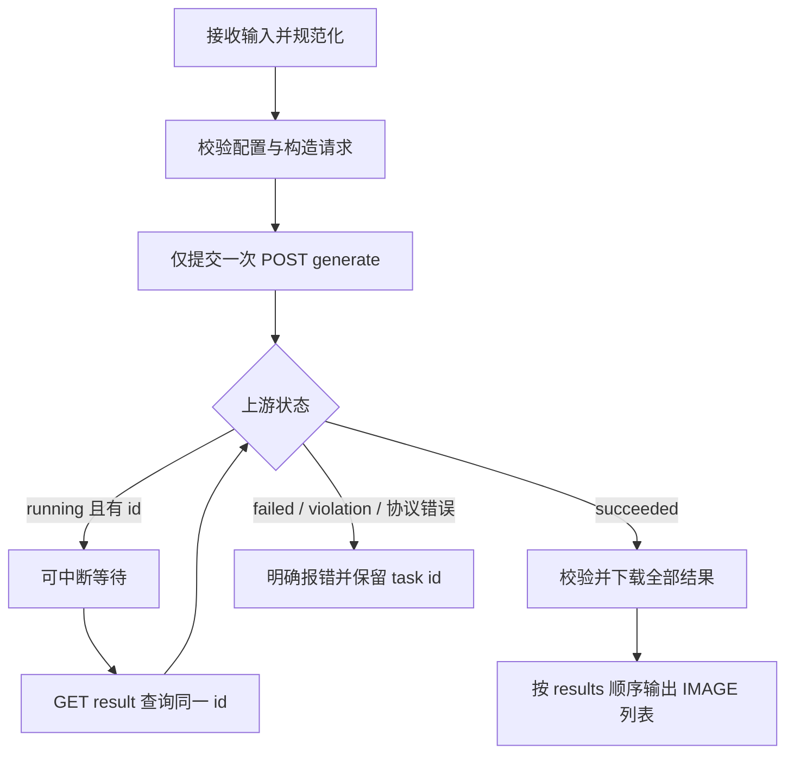

# GRSAI Provider 初始单次节点设计（历史）

> 本文保留最初 GRSAI 单 Provider 的设计背景，不再代表当前产品契约。当前节点 ID、Provider 选择、必填参考图与 RunningHub 支持以根目录 [README](../README.md) 为准。

状态：第一版核心节点已实现并完成离线/目标 ComfyUI 集成验证；余额 API 尚未真实验证。

日期：2026-09-16。目标为实施时最新稳定版 ComfyUI 与配套前端；发布前记录实测版本，不把“最新”当作永久兼容承诺。

## 1. 目标与范围

一个图片生成节点覆盖 Nano Banana 与 GPT Image：输入 API Key、模型、提示词、模型相关参数和可选图片；内部完成提交、等待、下载；向下游输出图片。

生成流程接入 `POST /v1/api/generate` 与 `GET /v1/api/result?id=...`。两类模型共享提交路径，参数不同。账户余额使用 Token 调用 `POST /client/openapi/getCredits`；模型切换使用 `GET /client/common/getModelStatus` 做非阻塞提示。

本版不做批量任务节点、独立查询节点、视频、Flux、其他兼容协议、上传服务、模型自动发现、透明背景生成、遮罩编辑、seed、生成张数、节点内生成按钮或重复入队拦截。未来批量功能只复用单次生成服务，不提前加入调度器。

资料优先级：用户确认的产品行为 → 指定新接口文档 → ComfyUI 当前官方机制 → 用户提供的参考项目。参考项目使用旧接口，不能替代新接口契约。

## 2. 已确认决策

| 项目 | 决定 |
| --- | --- |
| 节点数 | 一个统一生成节点 |
| 模型维护 | 节点目录内 JSON 配置，精简默认模型 |
| 参数界面 | 随具体模型切换；Nano 比例与分辨率分开，GPT 尺寸与质量分开 |
| 图片输入 | 必填 `images` 插口，通过连线输入 1–10 张参考图，支持批次与列表 |
| 多图含义 | 有序参考图，共同参与一次请求，不逐图生成 |
| 连接配置 | 独立 `API Config` 节点提供 API Key、可选 Base URL 和可选 Token；不是安全密钥存储功能 |
| 缓存 | 本节点每次实际执行均新建生成任务，不复用上次生成结果 |
| 队列 | 遵循 ComfyUI 原生执行队列，不改全局运行按钮 |
| 等待 | 节点内部异步提交和轮询，完成图片下载后才向下游输出 |
| 总超时意图 | 尽量不因本地总时限提前结束；默认不设总等待截止时间 |
| 结果 | 输出全部图片，保序、不改变尺寸、不静默丢图 |
| 失败 | 明确报错，不返回原图或占位图伪装成功 |
| 余额 | 同一节点内显示当前账户 Token 的剩余积分，每次生成结束后自动刷新；查询不影响图片结果 |

此前“合并尺寸选项”“相同参数命中缓存”“执行中禁用按钮”的方案已被本表取代。

## 3. 节点界面

显示名称为 `Image Generate`；稳定节点 ID 保留 `ImageGenerate`，界面名称与具体域名解耦，同时避免节点类型失效。

固定输入：`api_config` 配置连线、`model` 下拉、`prompt` 多行字符串、`images` 必填 IMAGE 连线。提示词支持由上游字符串连接；一个生成请求只能有一个提示词。

另有只读状态 `Balance`：初始为未查询，生成结束后异步更新。它不是工作流输入或输出，不新增余额节点或生成按钮。详细规则见第 10 节。

| 模型族 | 显示控件 | 请求字段 |
| --- | --- | --- |
| Nano Banana 2 / Pro | 图片比例、分辨率 | `aspectRatio`、`imageSize` |
| GPT Image | 图片尺寸、质量 | `aspectRatio`、`quality` |

所有枚举和默认值来自配置。不适用的控件隐藏；只有一个合法值的控件显示当前值并禁用选择。V3 原生动态控件优先，单选项禁用若需要前端扩展，仅作用于本节点。

切换模型时，参数仍合法则保留；不合法则采用新模型默认值并立即更新界面。后端只按当前模型构建请求，不提交隐藏参数。载入引用已删除模型或无效参数的旧工作流时明确报错，不静默换模型。

输出为一个 IMAGE 类型插口 `images`，声明 list 输出，每项为 `[1,H,W,3]` 浮点张量。单张结果亦为长度 1 的列表；保存、预览及后处理节点通过 ComfyUI 列表机制接收。节点自身不是终端保存节点，需要连接可执行的下游分支。

第一版不请求透明背景，输出 RGB，不承诺 alpha 工作流。若返回含非不透明 alpha 的图像，应报明确的输出兼容错误并保留任务 ID，避免静默丢透明信息；后续透明输出需单独约定 IMAGE/MASK 接口。

## 4. 精简模型与配置

用户已确认默认启用以下七个模型，按此顺序展示：

1. `nano-banana-2`
2. `nano-banana-pro`
3. `gpt-image-2`
4. `gpt-image-2-vip`
5. `gpt-image-2.5`
6. `gpt-image-2.5-flare`
7. `gpt-image-2.5-sunburst`

默认选中仍为 `nano-banana-2`。模型组顺序决定下拉顺序；多个组可复用同一 profile。

这是产品目录取舍，不是模型质量、速度或价格排名。其他变体保留在原始 API 文档中，用户可自行加入兼容配置。

运行示例见根目录 [grsai_config.example.json](../grsai_config.example.json)；用户复制为根目录 `grsai_config.json` 编辑。后者优先，缺省使用示例；升级不覆盖用户文件。`docs/examples/` 保留最初的设计样例。

结构分为三部分：

- `parameter_presets`：可复用的选项组，每个选项含稳定的 `value` 和显示 `label`。
- `profiles`：模型参数规则，指定 family、参数引用的选项组与默认值。
- `model_groups`：字符串模型列表及其 profile；同一规则的新模型只需追加字符串。不同规则可新增配置 profile，不推测名称后缀含义。

模型组的 `enabled` 控制是否出现在节点下拉中；当前七个模型全部启用。高分辨率 GPT 示例先提供方图与 16:9 横竖图的 1K/2K/4K 九组选项；其他文档列出的固定尺寸可按同格式追加。所有配置组合均需实际调用验证，不能把示例文件当作已验证能力清单。

`base_url`、图片编码与网络等待参数也在同一文件。默认国内地址；接口路径固定在客户端。API Key 不写入模型配置，而由节点输入提供。

配置加载时校验版本、重复模型、选项值唯一性、profile 引用、默认值存在性，以及 family 可用的字段。配置不能覆盖 `model`、`prompt`、`images`、`replyType`、认证头或任意请求路径。新增同类选项无需 Python 修改；协议发生变化仍需代码适配。

修改配置后重启 ComfyUI 并刷新页面生效；一次执行使用不可变的配置快照，轮询中不重新加载配置。不实现热更新端点。

## 5. 输入图片规范化

采用 V3 全列表接收机制，防止 ComfyUI 为每个图片列表元素调用一次生成方法。除图片外的标量输入必须恰好一个值，不做提示词/模型批量广播；动态输入字典和 list 的实际包装方式需在目标版本验证。

按“列表顺序 → 每个批次内部顺序”展开成单图序列。例如 `[batch(A,B), batch(C)]` 对应一次 `images: [A,B,C]` 请求。

每张图片保持各自宽高，不缩放、不补边，不跳过转换失败的图片。任一图片无效则提交前失败，并注明其序号。

JPG/JPEG/PNG/WEBP 文件由上游加载节点解码，本节点接收张量而非文件路径；内部转为 PNG 字节并 base64 编码。原文件格式、EXIF、ICC 和 alpha 是否保留取决于上游解码，不承诺保持原文件二进制或元数据。不连接图片时在提交前报错；当前通用契约只支持包含 1–10 张参考图的请求。

默认编码 `base64_png` 为裸 base64，参考项目也有此实现，但使用的是旧接口。保留配置值 `data_url_png` 供新接口验证后选择；绝不因一种编码失败而自动用另一种编码再次 POST。

API 图片数/字节限制未明确，不伪装成已知平台限制。任何本地内存保护阈值须标明是本地阈值，不沿用参考项目固定插口数量作为 API 上限。

## 6. 请求构造与执行

纯函数 `build_request(model, prompt, parameters, encoded_images, config)` 返回受控请求对象。Nano 只提交比例与分辨率，GPT 只提交尺寸与质量；具体选项由模型 profile 决定。共同字段为 `model`、`prompt`、`images`、`replyType: async`。

模型枚举与参数枚举在执行前再次验证，不能只依赖前端下拉。Key 去除首尾空白并检查非空，不凭示例强制要求 `sk-` 前缀；其有效性由服务端判断。



节点内部 `async execute` 等待服务返回；异步 HTTP 不表示提前输出 task ID，下游必须等图片就绪。提交直接返回成功时也正常处理，不强制多查询一次。

使用 V3 `fingerprint_inputs` 对应的每次变化机制，使本节点每次执行重新生成；防止相同输入的不同节点被错误合并，具体选项以目标版本验证为准。其他节点仍保留 ComfyUI 缓存。没有额外 seed 或重新生成按钮。

结果下载使用独立无认证请求，不把 GRSAI API Key 发送到图片 CDN。检查 HTTP 状态与实际图像可解码性；不按 URL 后缀断言格式。全部结果成功才输出，部分失败明确报错，保留 task ID 与失败索引；不能悄悄返回成功子集。

## 7. 超时、中断与重试

**区分总任务等待与一次网络操作。** 用户希望只要上游仍正常生成，就不要被本地短时限打断。因此默认 `task_timeout_seconds: null` 表示无总等待期限；有需要可在配置中改成 86400 等较大值。

工程默认值建议：轮询间隔 3 秒，连接超时 15 秒，提交请求超时 120 秒，查询请求超时 60 秒，单张下载超时 120 秒。这些是本地初始设置，不是平台承诺。

| 情况 | 行为 |
| --- | --- |
| 提交失败且没有任务 ID | 不自动重发 POST；若响应丢失，提示可能已在远端创建任务 |
| running | 持续查询同一 ID，不设置默认总截止时间 |
| 查询暂时断网/单次请求超时 | 退避重试同一 GET，间隔逐步增大至 30 秒，展示正在重连 |
| 查询 HTTP 429/5xx | 作为暂时服务错误退避；如有合法 Retry-After 则遵循，等待依然可中断 |
| 明确 failed/violation 或不可恢复的认证/参数/协议错误 | 立即结束并报告错误 |
| 图片下载失败 | 原 URL 有限重试（额外至多 3 次），仍失败则报错，不重新生成 |
| 用户中断 | 取消本地 HTTP 等待、轮询、重试与下载；不得捕获中断后继续轮询 |

中断检查覆盖请求进行中和退避等待中，不只放在一次长 HTTP 返回之后。实现时用可取消异步 I/O 并接入 ComfyUI 中断信号；目标为网络等待阶段约 1 秒内响应，须实测。不使用几百秒不可中断的同步请求充当等待方案。

取消本地执行不代表远端任务取消。已获得的 task ID 写入精简日志/错误信息，方便排查；不将状态为 running 的远端任务标为 failed。未设总时限意味着上游永久 running 时需用户主动中断，这是默认长等待行为的明确边界。

## 8. 代码职责与未来复用

实际实现目录：

```text
__init__.py                 V3 扩展入口
nodes.py                    单次生成节点与 ComfyUI 数据适配
config.py                   JSON 读取、校验与模型目录
request_builder.py          参数校验与请求构造
client.py                   单次生成、轮询、下载与取消
api_config.py               API Config 节点
api_settings.py             运行时凭据和 Base URL 校验
balance.py                  独立的 Token 账户余额查询与解析
model_status.py             非阻塞模型状态查询与解析
images.py                   图片列表展开、编码、结果张量转换
grsai_config.example.json   默认配置
web/                       原生控件无法满足时的最小界面扩展
tests/                     离线契约与宿主集成验证
```

网络客户端不依赖 ComfyUI 节点对象或浏览器状态。调用者传入取消与进度回调；每次生成的 task ID、认证、请求参数均属于该次调用，不保存在全局可变变量中。未来批量节点可多次调用同一服务，不改变单次服务的语义。

## 9. 日志与验收

日志仅包含模型、参数、图片数量、阶段、状态、task ID 与清理后的错误。不记录 Key、完整 base64、完整请求或默认打印完整提示词。允许 Key 随工作流保存是用户选择，但不是允许把它写进调试日志。

实施后必须验证：

1. 四类输入：无图、单图、同尺寸批次、不同尺寸列表；每次恰好一次 POST，多图顺序和数量正确。
2. 模型切换、参数隐藏/默认值、单选项禁用、工作流保存重载、删除配置项后的明确报错。
3. 请求体符合 family，未知/隐藏参数不会泄漏到请求；标量列表长度错误不能触发意外多次生成。
4. 相同参数连续执行两次产生两个任务；一次执行内查询重试不产生新任务。
5. running → succeeded / failed / violation、HTTP 200 业务失败、空结果、未知状态、暂时断网与部分下载失败。
6. 超过旧的 600/700 秒仍正常等待；关闭总时限与配置大时限的行为符合设置；各等待阶段均能中断。
7. 多个异尺寸结果保序、无缩放/补边；Preview/Save 接收全部 IMAGE list 元素。
8. API Key 不进入日志或 CDN 请求；中断及 HTTP 客户端资源正确释放。
9. 生成成功/失败后的余额自动刷新、0 积分显示、业务错误、过期响应隔离，以及余额查询失败不会使生成失败。

先做离线 mock 与目标 ComfyUI 集成测试。真实 API 联调需要有效 Key，验证图片编码和所选模型能力；本次没有调用计费 API，不把静态参考代码当作联调证据。

参考：[接口笔记](api-notes.md)、[资料索引](references/README.md)。

## 10. 账户积分余额

同一生成节点显示账户积分，每次生成结束后自动刷新。Token 来自 `API Config`；未提供 Token 时不调用余额接口，也不增加独立余额节点或刷新按钮。

请求地址为运行时 Base URL 加 `/client/openapi/getCredits`，不能误拼为 `/v1/client/...`。使用 `Content-Type: application/json`，请求体为 `{"token":"..."}`；不发送生成接口的 Bearer 认证头。

判定成功需同时满足 HTTP 成功、JSON 对象、`code === 0`、`data.credits` 为有限数值（排除布尔值）。0 是有效余额，不视为字段缺失。`code != 0` 即业务失败，显示清理后的 msg；字段缺失、类型错误或非 JSON 响应不得回退成 0。

界面显示 `Balance: 10,000` 和最近查询时间，不换算人民币/美元，不将前后余额差当作当前图片的精确费用。该接口只提供账户余额，不能证明单次扣费。

触发规则：

- 一次生成结束后刷新一次；包括成功，以及已经请求生成服务后的明确失败。图片下载最终失败也可刷新，因为远端任务可能已经成功扣费。
- 本地输入校验失败不刷新；轮询每次返回 running 不刷新；不增加生成前查询或定时查询。
- 用户中断工作流时不再启动新的余额请求；已有余额标为可能过期，下一次正常结束后更新。
- Config 连接或其内容改变时立即清除旧显示；旧查询不得覆盖新配置的状态。多次执行结果也应按查询序号避免旧响应覆盖新响应。

查询在 ComfyUI 后端执行，结果通过本节点的 UI 状态更新传到前端；不在浏览器直接跨域调用 GRSAI。后端使用有生命周期管理的异步任务或宿主机制执行，不留下无主后台任务；这是余额查询，不是新的生成任务。

余额查询独立于图片输出，超时建议 15 秒，不继承生成流程“无总时限”的设置。查询超时/失败显示“余额查询失败”；如展示上次结果必须明确标注非最新。不得撤销已完成图片、阻塞下游、覆盖原生成错误、触发重新生成，或凭旧余额预先拒绝生成。

余额不写回模型配置、不持久化为可复用工作流结果。日志不打印包含 Token 的请求体，错误消息中出现 Token 时必须脱敏。刷新显示不应修改执行输入，也不应自动把工作流重新加入队列。
